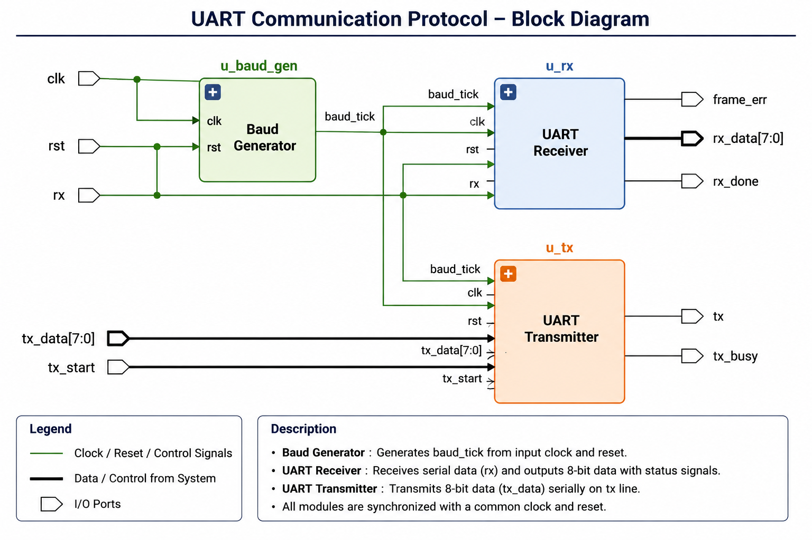

# UART Communication Protocol (Verilog HDL)

## Overview

This project implements a **UART (Universal Asynchronous Receiver Transmitter)** communication protocol using **Verilog HDL**. The design includes a parameterized baud rate generator, UART transmitter, UART receiver, top-level integration module, and a behavioral testbench for functional verification.

---

## Features

* 8-bit UART Communication
* 1 Start Bit
* 1 Stop Bit
* No Parity
* Parameterized Baud Rate Generator
* UART Transmitter (TX)
* UART Receiver (RX)
* Top-Level Integration Module
* Behavioral Testbench
* Loopback Verification
* Synthesizable RTL Design

---

## Project Structure

```text
UART_Communication_Protocol/

├── baud_generator.v
├── uart_tx.v
├── uart_rx.v
├── uart_top.v
├── uart_tb.v
├── UART.png
├── README.md
└── LICENSE
```

---

## Block Diagram



---

## Simulation Result

The design was successfully verified using a behavioral testbench.

**Example Result**

```text
Sent Byte     : 0x41
Received Byte : 0x41

Simulation Status : PASS
```

---

## Future Improvements

* UART Parity Support
* FIFO Integration
* Configurable Stop Bits
* Configurable Baud Rate
* AXI-Lite Interface

---

## Author

**Divyansh Dubey**
